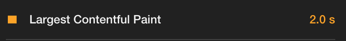
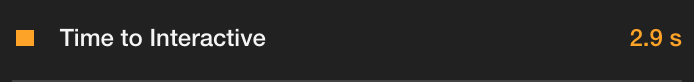
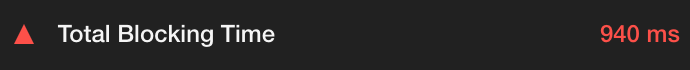
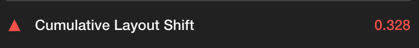
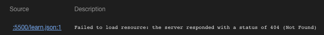

# Audit de performance du site
## http://todolistme.net/

### 1- Résumé du fonctionnement de l’ application
Notre concurrent propose une application de todo-list contenant les fonctionnalités suivantes : 
1. créer des catégories de liste de tâches à effectuer
2. créer des liste de tâches à effectuer, les enregistrer, les éditer et les effacer
3. donner une temporalité à ces tâches

### 2- Utilisation de Lighthouse
L’ audit de notre concurrent a été réalisé via l'outil Google Chrome Lighthouse permettant d'analyser différentes caractéristiques d'un site.

#### 2-1 First Contentful Paint
Lorsque l'on analyse la première partie de ce rapport on peut voir qu'un élément est plutôt performant : Le First Contentful Paint. Il correspond au premier élément du DOM qui s'affiche sur l'écran de l'utilisateur :

Cette donnée est considérée comme bonne par lighthouse car elle se situe en dessous du seuil des 1,8 secondes qui est considéré par l'outil comme le temps d'affichage limite pour une performance optimale.

#### 2-2 Speed Index
Le Speed Index mesure la rapidité avec laquelle le contenu est affiché visuellement pendant le chargement de la page :

Cette donnée, considérée comme moyenne car elle se situe au dessus du seuil des 1,5 secondes, peut s'expliquer par un travail trop important sur le fil principal de l'application, un temps d'éxécution trop long du Javascript, ou le manque d'un texte déjà présent le temps de chargement des polices. 

#### 2-3 Largest Contentful Paint
Le Largest Contentful Paint mesure le temps que met le plus grand élément du contenu à s'afficher :

Cette donnée est considérée comme moyenne car elle se situe entre 2 et 4 secondes, et peut s'expliquer par des éléments qui bloquent le rendu de la page comme certains fichiers CSS non cruciaux

#### 2-4 Time to Interactive
Le Time to Interactive mesure lle temps qu'il faut pour que la page devienne entièrement interactive :

Cette donnée est considérée comme moyenne car elle se situe entre 2 et 4 secondes. Une amélioration pouvant avoir un effet particulièrement important sur le TTI est la suppression des scripts inutiles. En particulier, la réduction des charges utiles JavaScript avec le fractionnement du code.

#### 2-5 Total Blocking Time
Le Total Blocking Time mesure le temps total pendant lequel une page est bloquée pour répondre aux entrées de l'utilisateur, comme les clics ou les utilisations clavier. La somme est calculée en ajoutant la partie bloquante de toutes les tâches longues entre le First Contentful Paint et le Time to Interactive. Toute tâche qui s'exécute pendant plus de 50 ms est considérée comme une tâche longue.

Avec 960ms, il serait important de remédier au problème pour réduire le Total Blocking Time. Pour cela une première piste pourrait être de limiter le nombre de fournisseurs tiers redondants et essayez de charger du code tiers une fois que votre page a principalement fini de se charger. De plus les scripts externes injectés dynamiquement via `document.write()` peuvent retarder le chargement de la page de plusieurs dizaines de secondes

#### 2-6 Cumulative Layout Shift
Le Cumulative Layout Shift mesure chaque changement de mise en page inattendu qui se produit pendant toute la durée de vie d'une page. 
Un changement de mise en page se produit chaque fois qu'un élément visible change de position d'une image rendue à la suivante.

Dans le contexte de cet audit, c'est certainement l'absence de largeur et de hauteur définies pour les images qui constituent la mauvaise performance du CLS.
De plus l'apparition des encarts publicitaires amplifient le phénomène car elles mettent plus de temps à charger.

### 2- Comparaison avec notre Application
En terme de performance, l'application est quasi parfaite, il faudrait juste supprimer un console.log d'erreur du à une erreur d'accès au serveur.

