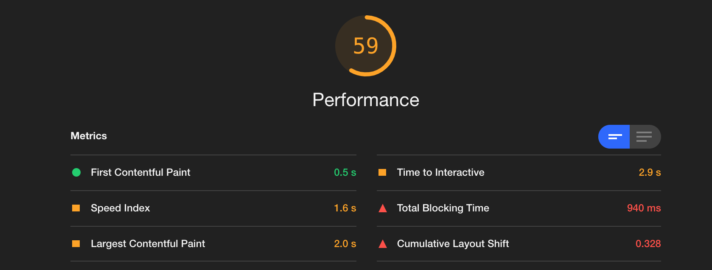

# Audit de performance du site
## http://todolistme.net/

### 1- Résumé du fonctionnement de l’ application

Notre concurrent propose une application de todo-list contenant les fonctionnalités suivantes : 
1. créer des catégories de liste de tâches à effectuer
2. créer des liste de tâches à effectuer, les enregistrer, les éditer et les effacer
3. donner une temporalité à ces tâches

### 2- Utilisation de Lighthouse
L’ audit de notre concurrent a été réalisé via l'outil Google Chrome Lighthouse permettant d'analyser différentes caractéristiques d'un site.

#### 2-1-1 First Contentful Paint
Lorsque l'on analyse la première partie de ce rapport on peut voir qu'un élément est plutôt performant : Le First Contentful Paint. Il correspond au premier élément du DOM qui s'affiche sur l'écran de l'utilisateur :
##### Ici, il s'affiche en 0,8 secondes.

Cette donnée est considérée comme bonne par lighthouse car elle se situe en dessous du seuil des 1,8 secondes qui est considéré par l'outil comme le temps d'affichage limite pour une performance optimale.

#### 2-1-2 Speed Index
Le Speed Index mesure la rapidité avec laquelle le contenu est affiché visuellement pendant le chargement de la page :
##### 1,6 secondes durant le test

Cette donnée, considérée comme moyenne car elle se situe en dessous du seuil des 1,8 secondes, peut s'expliquer par un travail trop important sur  le fil principal de l'application, un temps d'éxécution trop long du Javascript, ou le manque d'un texte déjà présent le temps que les fonts chargent. 

#### 2-1-3 Largest Contentful Paint
#### 2-1-4 Time to Interactive
#### 2-1-5 Total Blocking Time
#### 2-1-6 Cumulative Layout Shift

