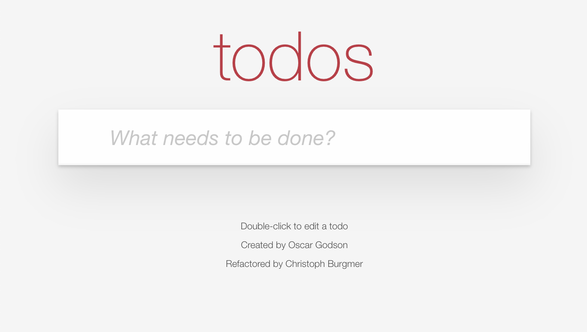
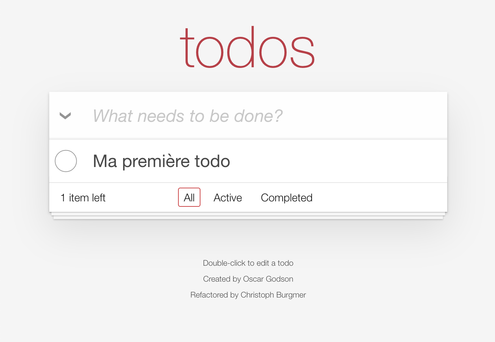
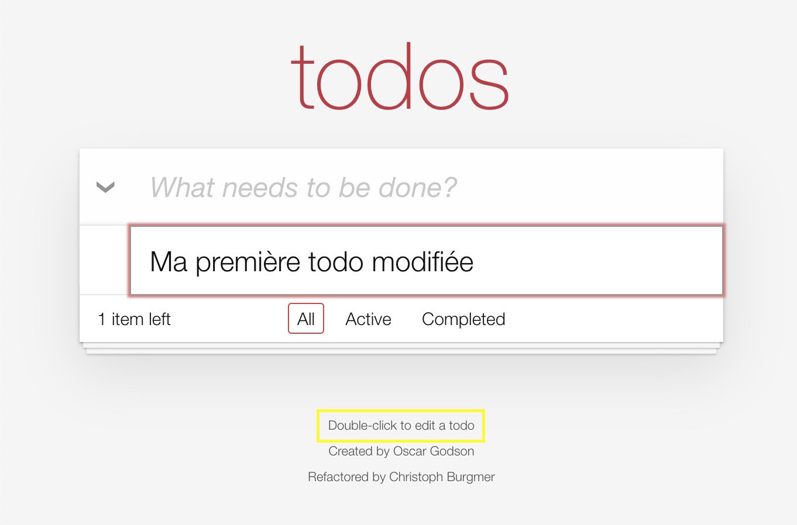
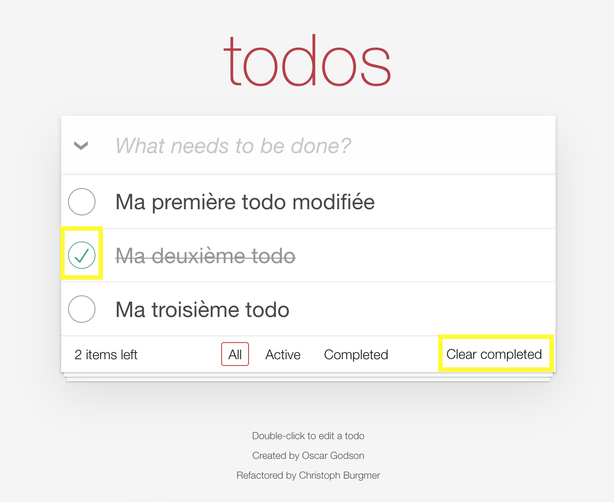
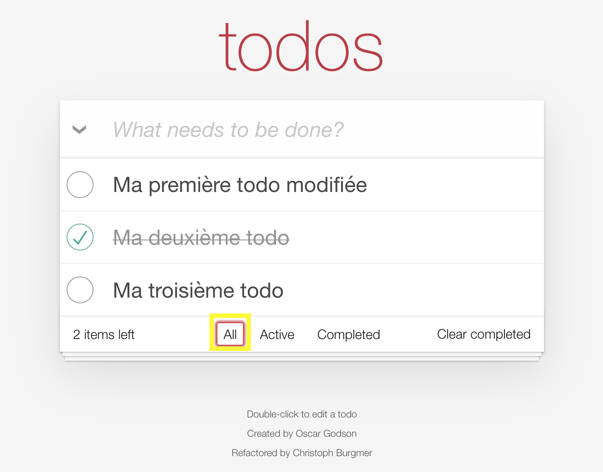
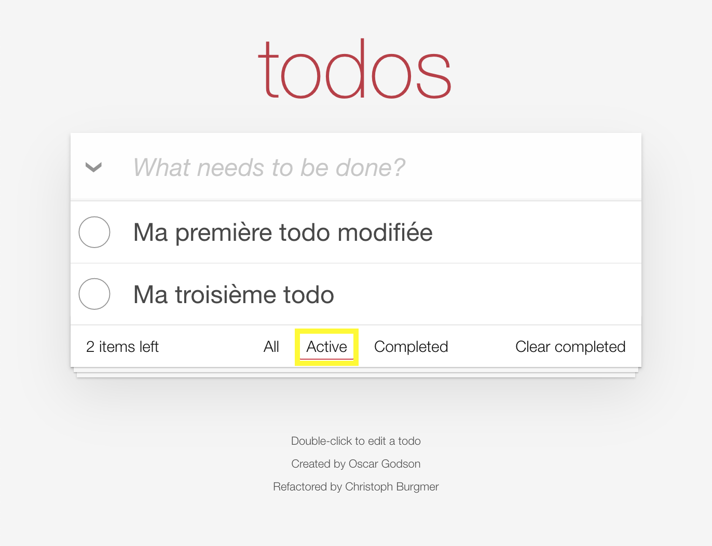
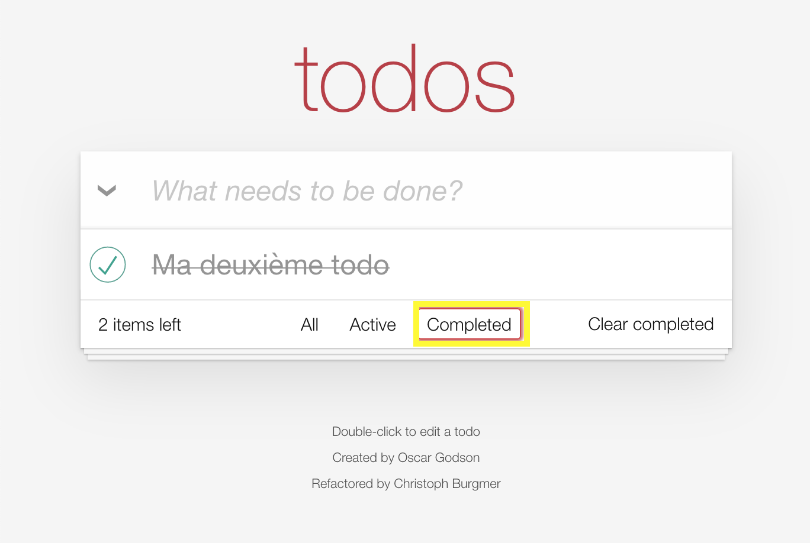
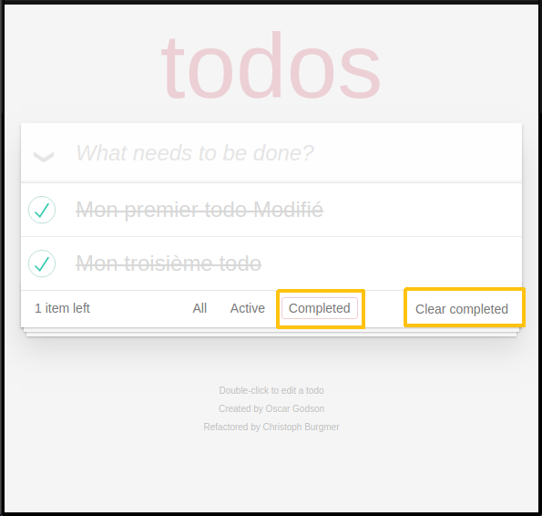
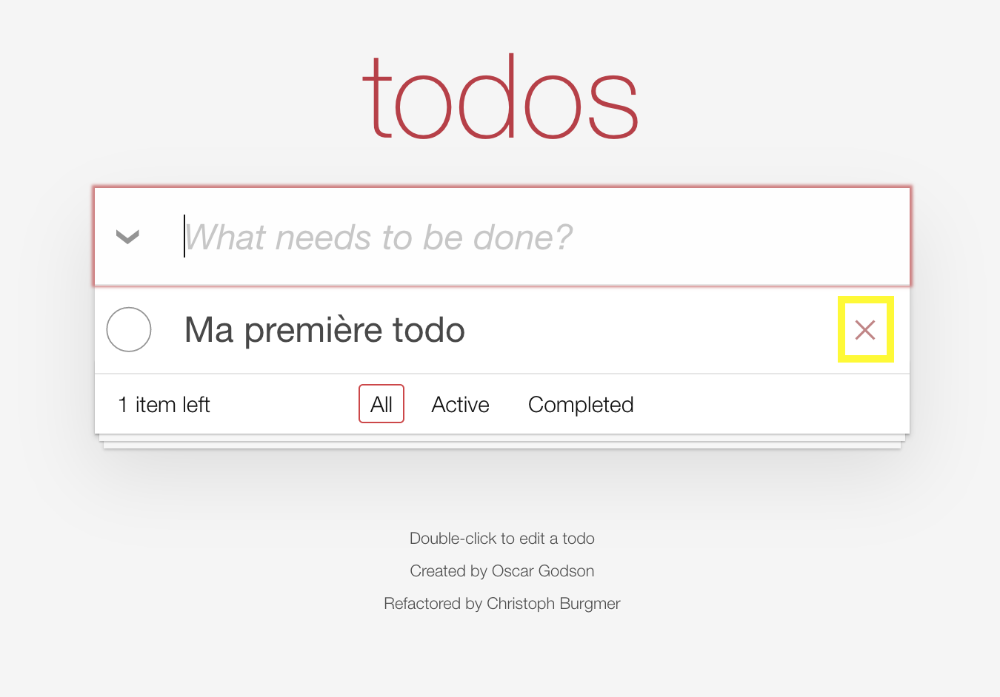

# Documentation utilisateur de notre application Todos

Notre application a pour objectif de vous permettre très facilement de créer des todos-list.

Pour ce faire nous avons élaboré des fonctions permettant de créer, de modifier ou supprimer des éléments.

Nous vous proposons donc de voir comment réaliser les actions suivantes :

1. créer une todo
2. modifier une todo
3. modifier l’état d’avancement d’une todo
4. voir l’état de nos todos
5. supprimer une ou plusieurs todos

## 1. Créer un Todo

Notre application se présente de la façon suivante.

Pour créer une todo, cliquer dans « what needs to be done ? » et rédiger la todo.

Appuyer sur _entrée_ pour enregistrer le todo.

Vous avez créé votre première todo.

Votre todo apparaît dans la liste des todos.

Plusieurs éléments sont apparus :
+ une icône à gauche de « what needs to be done ? »
+ une indication du nombre de todos, ici _1 item left_
+ un onglet __all__
+ un onglet __active__
+ un onglet __completed__

## 2. Modifier un Todo

Dans le but d’avoir l’application la plus simple possible nous avons choisi de permettre l’édition d'une todo en double cliquant sur celle à modifier.

Taper sur _Entrée_ pour valider la modification ou sur _échap_ pour l'annuler.

La todo qui est en cours de modification est encadrée.

## 3. Modifier l’état d’avancement d’un todo

Nous avons créé 3 todos, notre deuxième todo est terminée.

Pour signifier que votre todo est terminée, il suffit de cliquer dans le cercle à gauche de la todo.

Une fois cette étape réalisée, la todo est barrée et un bouton __Clear completed__ apparaît en bas à droite. 

Ce bouton sert à effacer la todo que l’on a indiqué comme terminée.

## 4. Voir l’état de nos todos

1. 

Le bouton __All__ nous montre l’ensemble des Todos, peut importe leur état.

2. 

Le bouton __Active__ nous montre les Todos en cours.

3. 

Le bouton __Completed__ nous montre les todos que nous avons terminé.

## 5. Supprimer une ou plusieurs todos

Pour supprimer définitivement nos todos terminées, il suffit de cliquer sur le bouton __clear completed__ .

Cette action effacera définitivement les todos en question.

Nous pouvons supprimer directement les todos une par une à la volée sans passer par l’onglet __Completed__. 

Pour cela, lorsque l’on survole une todo une croix à droite apparaît.

Cliquer sur la croix supprime définitivement la todo en question. 

